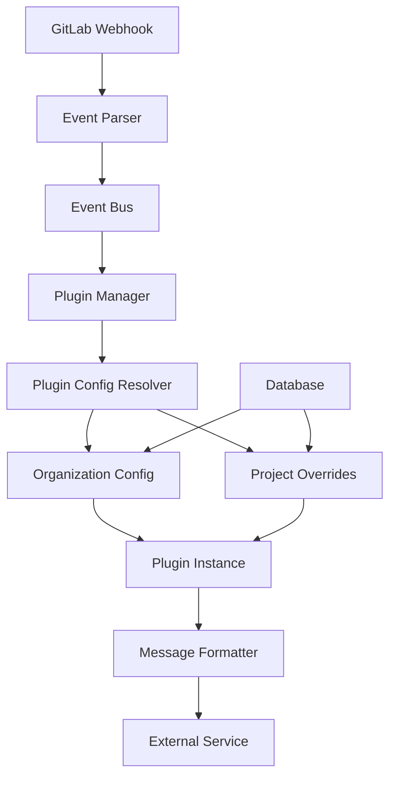

# GitLumen Plugins System

The GitLumen plugin system provides a flexible, extensible architecture for integrating with various notification services and external tools. This guide explains how the plugin system works and how to create new plugins.

## Table of Contents

- [Overview](#overview)
- [Architecture](#architecture)
- [Configuration System](#configuration-system)
- [Available Plugins](#available-plugins)
- [Creating a New Plugin](#creating-a-new-plugin)
- [Plugin Development Guide](#plugin-development-guide)
- [Best Practices](#best-practices)
- [API Reference](#api-reference)

## Overview

GitLumen's plugin system allows organizations to:

- **Send notifications** to multiple platforms (Teams, Slack, Discord, etc.)
- **Transform event data** using custom formatters
- **Configure routing** per project and organization
- **Extend functionality** without modifying core code
- **Scale integrations** across multiple teams and projects

### Key Features

- 🔌 **Pluggable Architecture** - Add new integrations without touching core code
- 🏢 **Multi-tenant** - Organization-level plugin configurations
- 📁 **Project-specific** - Per-project overrides and customization
- 🎨 **Flexible Formatting** - Custom message templates and styling
- 🔄 **Event-driven** - Responds to GitLab events (push, merge, issues, etc.)
- ⚙️ **Hot-configurable** - Update settings without restarts

## Architecture



### Core Components

1. **Plugin Interface** - Defines the contract all plugins must implement
2. **Plugin Manager** - Orchestrates plugin loading and execution
3. **Config Resolver** - Merges organization and project-level configurations
4. **Message Formatter** - Transforms events into platform-specific messages
5. **Event System** - Routes events to appropriate plugins

## Configuration System

GitLumen uses a two-tier configuration system:

### Organization-Level Configuration (`plugin_configs`)

```typescript
interface PluginConfig {
  id: string;
  name: string;          // "Teams Notifications"
  type: string;          // "teams", "slack", "discord"
  isActive: boolean;
  config: ConfigObject; // Plugin-specific settings
  organizationId: string;
}
```

**Example:**
```json
{
  "name": "Teams Engineering Bot",
  "type": "teams",
  "isActive": true,
  "config": {
    "webhookUrl": "https://outlook.office.com/webhook/...",
    "botName": "GitLumen Bot",
    "colorScheme": {
      "success": "#00ff00",
      "warning": "#ffaa00",
      "error": "#ff0000"
    }
  }
}
```

### Project-Level Overrides (`project_plugin_configs`)

```typescript
interface ProjectPluginConfig {
  id: string;
  projectId: string;
  pluginConfigId: string;
  isEnabled: boolean;
  config: ConfigObject; // Project-specific overrides
}
```

**Example:**
```json
{
  "projectId": "api-service",
  "pluginConfigId": "teams-eng-bot",
  "isEnabled": true,
  "config": {
    "channel": "#api-team",
    "mentionUsers": ["@john.doe", "@jane.smith"],
    "enableMentions": true
  }
}
```

### Configuration Merging

When an event occurs:
1. Load organization-level plugin config
2. Apply project-specific overrides
3. Create plugin instance with merged config
4. Execute notification

```typescript
const finalConfig = {
  ...organizationConfig,
  ...projectOverrides
};
```

## Available Plugins

### Microsoft Teams Plugin

**Type:** `teams`
**Package:** `@gitlumen/plugin-teams`

Sends rich, formatted notifications to Microsoft Teams channels.

**Configuration:**
```typescript
interface TeamsPluginConfig {
  webhookUrl: string;
  botName: string;
  botAvatar?: string;
  defaultChannel?: string;
  enableMentions?: boolean;
  mentionUsers?: string[];
  colorScheme?: {
    success: string;
    warning: string;
    error: string;
    info: string;
  };
}
```

**Supported Events:**
- Push events
- Merge request events
- Issue events
- Pipeline events
- Tag events

### Slack Plugin (Coming Soon)

**Type:** `slack`
**Package:** `@gitlumen/plugin-slack`

### Discord Plugin (Coming Soon)

**Type:** `discord`
**Package:** `@gitlumen/plugin-discord`

## Creating a New Plugin

### 1. Plugin Interface

All plugins must implement the `Plugin` interface:

```typescript
import { Plugin, PluginRuntimeConfig, NotificationEvent, NotificationResult } from '@gitlumen/core';

export class MyPlugin implements Plugin {
  public readonly id: string;
  public readonly name: string;
  public readonly type: string;

  constructor(config: PluginRuntimeConfig) {
    this.id = config.id;
    this.name = config.name;
    this.type = config.type;
    // Initialize your plugin
  }

  async notify(event: NotificationEvent): Promise<NotificationResult> {
    // Implement notification logic
  }

  async healthCheck(): Promise<boolean> {
    // Implement health check
  }
}
```

### 2. Directory Structure

Create a new plugin package:

```
packages/plugins/my-plugin/
├── package.json
├── tsconfig.json
├── src/
│   ├── index.ts
│   ├── my-plugin.ts
│   ├── client.ts
│   ├── formatter.ts
│   └── types.ts
```

### 3. Package Configuration

**`package.json`:**
```json
{
  "name": "@gitlumen/plugin-my-plugin",
  "version": "1.0.0",
  "main": "dist/index.js",
  "types": "dist/index.d.ts",
  "dependencies": {
    "@gitlumen/core": "*"
  }
}
```

### 4. Plugin Implementation

**`src/my-plugin.ts`:**
```typescript
import { Plugin, PluginRuntimeConfig, NotificationEvent, NotificationResult } from '@gitlumen/core';
import { MyServiceClient } from './client';
import { MessageFormatter } from './formatter';

export interface MyPluginConfig {
  apiKey: string;
  endpoint: string;
  channel?: string;
}

export class MyPlugin implements Plugin {
  public readonly id: string;
  public readonly name: string;
  public readonly type = 'my-plugin';

  private config: MyPluginConfig;
  private client: MyServiceClient;
  private formatter: MessageFormatter;

  constructor(runtimeConfig: PluginRuntimeConfig) {
    this.id = runtimeConfig.id;
    this.name = runtimeConfig.name;
    this.config = runtimeConfig.config as MyPluginConfig;
    
    this.client = new MyServiceClient(this.config);
    this.formatter = new MessageFormatter(this.config);
  }

  async notify(event: NotificationEvent): Promise<NotificationResult> {
    try {
      const message = this.formatter.formatEvent(event);
      const response = await this.client.sendMessage(message);
      
      return {
        success: true,
        pluginId: this.id,
        timestamp: new Date(),
        metadata: { messageId: response.id }
      };
    } catch (error) {
      return {
        success: false,
        pluginId: this.id,
        timestamp: new Date(),
        error: error.message
      };
    }
  }

  async healthCheck(): Promise<boolean> {
    try {
      return await this.client.ping();
    } catch {
      return false;
    }
  }
}
```

### 5. Message Formatter

**`src/formatter.ts`:**
```typescript
import { NotificationEvent, PushEvent, MergeRequestEvent } from '@gitlumen/core';

export class MessageFormatter {
  constructor(private config: MyPluginConfig) {}

  formatEvent(event: NotificationEvent): string {
    switch (event.type) {
      case 'push':
        return this.formatPushEvent(event as PushEvent);
      case 'merge_request':
        return this.formatMergeRequestEvent(event as MergeRequestEvent);
      default:
        return this.formatGenericEvent(event);
    }
  }

  private formatPushEvent(event: PushEvent): string {
    return `🔄 **${event.user.name}** pushed to **${event.project.name}**\n` +
           `Branch: \`${event.ref}\`\n` +
           `Commits: ${event.commits.length}`;
  }

  private formatMergeRequestEvent(event: MergeRequestEvent): string {
    return `🔀 **Merge Request ${event.action}**\n` +
           `${event.object_attributes.title}\n` +
           `By: ${event.user.name}`;
  }

  private formatGenericEvent(event: NotificationEvent): string {
    return `📢 ${event.type} event in ${event.project.name}`;
  }
}
```

### 6. Client Implementation

**`src/client.ts`:**
```typescript
export class MyServiceClient {
  private apiKey: string;
  private endpoint: string;

  constructor(config: MyPluginConfig) {
    this.apiKey = config.apiKey;
    this.endpoint = config.endpoint;
  }

  async sendMessage(message: string): Promise<{ id: string }> {
    const response = await fetch(`${this.endpoint}/messages`, {
      method: 'POST',
      headers: {
        'Authorization': `Bearer ${this.apiKey}`,
        'Content-Type': 'application/json'
      },
      body: JSON.stringify({ 
        text: message,
        channel: this.config.channel 
      })
    });

    if (!response.ok) {
      throw new Error(`API request failed: ${response.statusText}`);
    }

    return response.json();
  }

  async ping(): Promise<boolean> {
    try {
      const response = await fetch(`${this.endpoint}/health`, {
        headers: { 'Authorization': `Bearer ${this.apiKey}` }
      });
      return response.ok;
    } catch {
      return false;
    }
  }
}
```

### 7. Export Plugin

**`src/index.ts`:**
```typescript
export { MyPlugin } from './my-plugin';
export type { MyPluginConfig } from './my-plugin';
```

## Plugin Development Guide

### Development Workflow

1. **Create Plugin Package**
   ```bash
   mkdir packages/plugins/my-plugin
   cd packages/plugins/my-plugin
   npm init -y
   ```

2. **Install Dependencies**
   ```bash
   yarn add @gitlumen/core
   yarn add -D typescript @types/node
   ```

3. **Implement Plugin** (following the structure above)

4. **Build Plugin**
   ```bash
   yarn build
   ```

5. **Register Plugin** in the main application:
   ```typescript
   import { MyPlugin } from '@gitlumen/plugin-my-plugin';
   
   // Register in plugin factory
   export const pluginFactory = {
     'my-plugin': MyPlugin,
     'teams': TeamsPlugin,
     // ... other plugins
   };
   ```

### Testing Plugins

Create comprehensive tests for your plugin:

```typescript
// src/__tests__/my-plugin.test.ts
import { MyPlugin } from '../my-plugin';

describe('MyPlugin', () => {
  let plugin: MyPlugin;

  beforeEach(() => {
    plugin = new MyPlugin({
      id: 'test-plugin',
      name: 'Test Plugin',
      type: 'my-plugin',
      config: {
        apiKey: 'test-key',
        endpoint: 'https://api.example.com'
      }
    });
  });

  it('should format push events correctly', async () => {
    const event = createMockPushEvent();
    const result = await plugin.notify(event);
    
    expect(result.success).toBe(true);
    expect(result.pluginId).toBe('test-plugin');
  });

  it('should handle API errors gracefully', async () => {
    // Mock API failure
    const event = createMockPushEvent();
    const result = await plugin.notify(event);
    
    expect(result.success).toBe(false);
    expect(result.error).toBeDefined();
  });
});
```

### Configuration Validation

Add runtime configuration validation:

```typescript
import Joi from 'joi';

const configSchema = Joi.object({
  apiKey: Joi.string().required(),
  endpoint: Joi.string().uri().required(),
  channel: Joi.string().optional(),
  timeout: Joi.number().min(1000).default(5000)
});

export class MyPlugin implements Plugin {
  constructor(runtimeConfig: PluginRuntimeConfig) {
    const { error, value } = configSchema.validate(runtimeConfig.config);
    if (error) {
      throw new Error(`Invalid plugin configuration: ${error.message}`);
    }
    this.config = value;
    // ... rest of initialization
  }
}
```

## Best Practices

### Security

- **Never log sensitive data** (API keys, tokens, URLs)
- **Validate all inputs** from external services
- **Use environment variables** for secrets in development
- **Implement rate limiting** to avoid API quota issues

```typescript
// ❌ Bad
console.log('Sending to webhook:', this.config.webhookUrl);

// ✅ Good
console.log('Sending notification to configured webhook');
```

### Error Handling

- **Always return proper results** from `notify()`
- **Handle network timeouts** gracefully
- **Provide meaningful error messages**
- **Implement retry logic** for transient failures

```typescript
async notify(event: NotificationEvent): Promise<NotificationResult> {
  const maxRetries = 3;
  let lastError: Error;

  for (let attempt = 1; attempt <= maxRetries; attempt++) {
    try {
      const result = await this.sendNotification(event);
      return { success: true, pluginId: this.id, timestamp: new Date() };
    } catch (error) {
      lastError = error;
      if (attempt < maxRetries && this.isRetryable(error)) {
        await this.delay(1000 * attempt); // Exponential backoff
        continue;
      }
      break;
    }
  }

  return {
    success: false,
    pluginId: this.id,
    timestamp: new Date(),
    error: `Failed after ${maxRetries} attempts: ${lastError.message}`
  };
}
```

### Performance

- **Implement connection pooling** for HTTP clients
- **Cache client instances** when possible
- **Use async/await** for non-blocking operations
- **Set reasonable timeouts** for external calls

```typescript
// ✅ Good - Reuse HTTP client
export class MyServiceClient {
  private static httpClient = new HttpClient({
    timeout: 5000,
    keepAlive: true
  });

  async sendMessage(message: string) {
    return MyServiceClient.httpClient.post('/messages', { message });
  }
}
```

### Configuration

- **Provide sensible defaults** for optional settings
- **Document all configuration options**
- **Support both organization and project-level** config
- **Validate configuration** at plugin initialization

```typescript
interface MyPluginConfig {
  apiKey: string;                    // Required
  endpoint: string;                  // Required
  channel?: string;                  // Optional
  timeout?: number;                  // Optional, default: 5000
  retryAttempts?: number;           // Optional, default: 3
  enableMentions?: boolean;         // Optional, default: false
}

const DEFAULT_CONFIG = {
  timeout: 5000,
  retryAttempts: 3,
  enableMentions: false
};
```

## API Reference

### Core Interfaces

#### Plugin Interface

```typescript
interface Plugin {
  readonly id: string;
  readonly name: string;
  readonly type: string;
  
  notify(event: NotificationEvent): Promise<NotificationResult>;
  healthCheck(): Promise<boolean>;
}
```

#### PluginRuntimeConfig

```typescript
interface PluginRuntimeConfig {
  id: string;
  name: string;
  type: string;
  config: ConfigObject;
}
```

#### NotificationEvent

```typescript
interface NotificationEvent {
  type: string;
  project: ProjectInfo;
  user: UserInfo;
  timestamp: Date;
  // Event-specific data
}
```

#### NotificationResult

```typescript
interface NotificationResult {
  success: boolean;
  pluginId: string;
  timestamp: Date;
  error?: string;
  metadata?: Record<string, any>;
}
```

### Event Types

GitLumen supports these GitLab webhook events:

- `push` - Code pushed to repository
- `merge_request` - Merge request created/updated/merged
- `issue` - Issue created/updated/closed
- `pipeline` - CI/CD pipeline status changes
- `tag_push` - Git tag created/deleted
- `release` - Release created/updated

### Utility Functions

```typescript
// Check if error is retryable
function isRetryableError(error: Error): boolean;

// Format user mentions
function formatMention(username: string, platform: string): string;

// Truncate long text with ellipsis
function truncateText(text: string, maxLength: number): string;

// Parse GitLab URLs
function parseGitLabUrl(url: string): { project: string; path: string };
```

---

## Getting Help

- 📖 **Documentation**: [GitLumen Docs](../README.md)
- 💬 **Discussions**: GitHub Discussions
- 🐛 **Issues**: GitHub Issues
- 📧 **Email**: support@gitlumen.dev

## Contributing

1. Fork the repository
2. Create a feature branch
3. Implement your plugin following this guide
4. Add comprehensive tests
5. Update documentation
6. Submit a pull request

---

**Happy Plugin Development! 🎉**